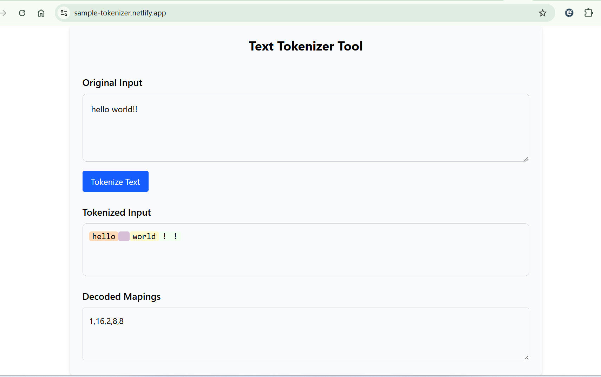

# Custom Tokenizer Tool

A simple React + Vite application that allows users to input text and view its tokenized representation using a custom mapping.

## Features

- **Text Input:** Enter any text in the provided textarea.
- **Tokenization:** Converts input text into an array of token values based on a predefined mapping.
- **Decoded Output:** Displays the decoded tokens and their corresponding values.
- **Colorful Visualization:** Each token is highlighted with a random background color for easy distinction.

## Getting Started

### Prerequisites

- [Node.js](https://nodejs.org/) (v18+ recommended)
- [npm](https://www.npmjs.com/) or [yarn](https://yarnpkg.com/)

### Installation

1. Clone the repository:
   ```sh
   git clone https://github.com/your-username/custom-tokenizer.git
   cd custom-tokenizer
   ```
2. Do npm install.
3. Once installed without any errors.
4. Give any text input to the user input field
   .
5. Live site is deployed in the netlify "https://sample-tokenizer.netlify.app/".
